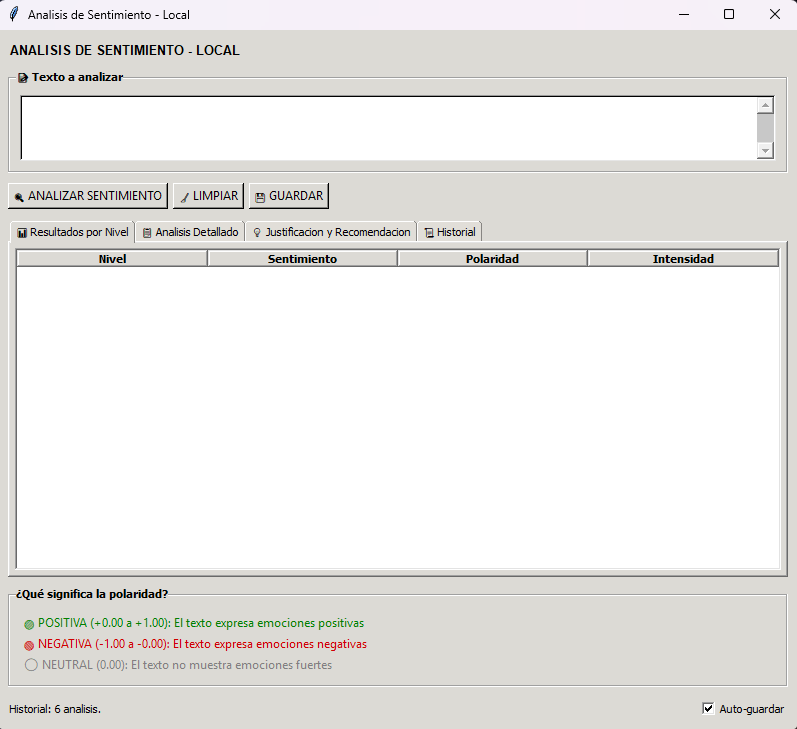

<div align="center">

# 🧠 NLP Sentimientos

> Sistema de análisis de sentimiento modular desarrollado en Python.
---

[](https://www.python.org/)
[](https://docs.pytest.org/)
[](https://docs.python.org/3/library/tkinter.html)
[](https://docs.astral.sh/ruff/)
[](https://github.com/features/actions)
[](https://pypi.org/project/python-dotenv/)
[](https://github.com/ollama/ollama)
[](https://coverage.readthedocs.io/)
[](https://opensource.org/licenses/MIT)
[](https://docs.astral.sh/ruff/)

</div>

## 📋 Resumen Ejecutivo

**NLP Sentimientos** es un sistema de análisis de sentimiento basado en inteligencia artificial que permite evaluar textos en tres niveles de profundidad: **básico**, **intermedio** y **avanzado**. El sistema utiliza modelos de lenguaje locales (Ollama) para procesar y analizar el contenido textual, devolviendo métricas de polaridad, emociones y recomendaciones.

Este sistema está diseñado para escenarios donde se requiere:

- ✅ Análisis rápido de sentimiento en textos individuales
- ✅ Procesamiento por lotes de múltiples documentos
- ✅ Persistencia automática de resultados para auditoría
- ✅ Interfaz gráfica para usuarios no técnicos
- ✅ CLI para integración en pipelines de datos

---

## 🏗️ Arquitectura del Sistema

El sistema sigue una arquitectura modular basada en responsabilidades claramente definidas.

```
MAIN.PY (Punto de entrada)
    │
    ├──────▶ GUI (Tkinter)
    │
    └──────▶ MENU (CLI)
              │
              ▼
        ┌─────────────────────┐
        │  SRC/SENTIMIENTO    │
        │  ├─ Analizador      │
        │  ├─ Niveles         │
        │  └─ Proveedor       │
        └─────────────────────┘
              │
              ▼
        ┌─────────────────────┐
        │ SRC/ALMACENAMIENTO  │
        │ ├─ Guardar (TXT)    │
        │ └─ Leer (Historial) │
        └─────────────────────┘
              │
              ▼
        ┌─────────────────────┐
        │      SRC/LOGS       │
        │  (Archivos salida)  │
        └─────────────────────┘
```

### Flujo de Datos

1. **Entrada** → main.py/gui.py
2. **Procesamiento** → src/sentimiento/
3. **Persistencia** → src/almacenamiento/
4. **Salida** → src/logs/

### 📦 Descripción de Módulos

| Módulo | Descripción |
|--------|-------------|
| `src/sentimiento/` | Núcleo del análisis de sentimiento |
| `src/almacenamiento/` | Persistencia de resultados |
| `src/gui/` | Interfaz gráfica de usuario |

---

## ✨ Características Principales

| Característica | Descripción |
|----------------|-------------|
| 🔍 | Análisis de sentimiento en tres niveles de profundidad |
| 🖥️ | Interfaz gráfica de usuario (GUI) construida con Tkinter |
| 💻 | Interfaz de línea de comandos (CLI) para integración |
| 💾 | Persistencia automática de resultados en TXT y JSON |
| 📚 | Procesamiento por lotes de múltiples textos |
| 🛡️ | Validación robusta de entrada |
| 📊 | Logs detallados para debugging |
| 🧪 | Tests unitarios con cobertura del 100% |
| ⚙️ | Configuración mediante variables de entorno |
| 🔄 | Integración continua con GitHub Actions |

---

## 🛠️ Tecnologías Utilizadas

| Categoría | Tecnología |
|-----------|------------|
| 🐍 Lenguaje | Python 3.10+, 3.11, 3.12, 3.13 |
| 🧪 Testing | pytest, pytest-cov |
| 🖥️ GUI | Tkinter (stdlib) |
| ✨ Linting | Ruff |
| 🔄 CI/CD | GitHub Actions |
| ⚙️ Variables de entorno | python-dotenv |
| 🤖 Modelos de IA | Ollama (gemma3:4b, qwen2.5:3b) |
| 🔒 Seguridad | bandit |

---

## 📂 Estructura del Proyecto

```
NLP_Sentimientos/
├── main.py                 # Punto de entrada con menú
├── gui.py                  # Ejecución directa de GUI
├── requirements.txt       # Dependencias del proyecto
├── setup.cfg              # Configuración de coverage
├── pytest.ini             # Configuración de pytest
├── .env.example           # Plantilla de configuración
│
├── src/
│   ├── __init__.py
│   ├── menu.py            # Menú CLI/GUI
│   ├── gui/               # Módulo de interfaz gráfica
│   │   ├── __init__.py
│   │   ├── widgets.py
│   │   └── tema.py
│   ├── sentimiento/        # Módulo de análisis
│   │   ├── __init__.py
│   │   ├── analizador.py
│   │   ├── niveles.py
│   │   ├── proveedor.py
│   │   └── multitexto.py
│   └── almacenamiento/     # Módulo de persistencia
│       ├── __init__.py
│       ├── guardar.py
│       └── leer.py
│
├── tests/                 # Suite de tests unitarios
│   ├── conftest.py
│   ├── test_almacenamiento.py
│   ├── test_analizador.py
│   ├── test_gui.py
│   └── test_sentimiento.py
│
├── scripts/               # Scripts auxiliares
│   └── check_folders.py
│
├── docs/                  # Documentación
│   └── InterfazLlegada.png
│
└── logs/                  # Resultados generados
    ├── json/
    └── txt/
```

---

## 📥 Instalación

### 📌 Requisitos

- Python 3.10, 3.11, 3.12 o 3.13
- Ollama instalado y configurado con un modelo de lenguaje (recomendado: gemma3:4b o qwen2.5:3b)

### 🚀 Pasos de Instalación

1. **Clonar el repositorio:**
```bash
git clone <repository-url>
cd NLP_Sentimientos
```

2. **Crear y activar entorno virtual:**
```bash
python -m venv .venv
.venv\Scripts\activate  # Windows
# source .venv/bin/activate  # Linux/Mac
```

3. **Instalar dependencias:**
```bash
pip install -r requirements.txt
```

4. **Configurar variables de entorno:**
```bash
# Crear archivo .env en la raíz del proyecto
cp .env.example .env
```

Editar el archivo `.env` con la configuración deseada:
```bash
# Configuración de Ollama (opcional, valor por defecto: qwen2.5:3b)
NLP_OLLAMA_MODEL=gemma3:4b
```

### 🔧 Configuración de Ollama

El sistema utiliza Ollama para el procesamiento de lenguaje natural. Asegúrate de tener Ollama instalado y al menos un modelo descargado:

```bash
ollama pull gemma3:4b
# o
ollama pull qwen2.5:3b
```

---

## 💻 Uso

### 🎯 Menú Principal

Ejecutar el punto de entrada con menú interactivo:
```bash
python main.py
```

Menú:
- Opción 1: Ejecutar GUI (Interfaz Gráfica)
- Opción 2: Ejecutar CLI (Línea de Comandos)
- Opción 3: Salir

### ⌨️ CLI

Análisis de texto directo:
```bash
python main.py "Me encanta este producto, es increíble"
```

Con guardado automático:
```bash
python main.py -g "Texto a analizar"
```

Modo interactivo:
```bash
python main.py
# Ingresa el texto cuando se indique
```

Listar análisis guardados:
```bash
python main.py -l
```

Nivel de análisis específico:
```bash
python main.py -n basico "Texto"
python main.py -n intermedio "Texto"
python main.py -n avanzado "Texto"
```

Modo verbose (debug):
```bash
python main.py -v "Texto"
```

### 🖥️ GUI

Ejecutar la interfaz gráfica directamente:
```bash
python gui.py
```




---

## ⚙️ Configuración

El sistema permite configuración mediante variables de entorno:

| Variable | Descripción | Valor por defecto |
|----------|-------------|-------------------|
| `NLP_OLLAMA_MODEL` | Modelo de Ollama a utilizar | `qwen2.5:3b` |
| `NLP_RESULTADOS_TXT` | Ruta para archivos TXT | `src/logs/txt/` |
| `NLP_RESULTADOS_JSON` | Ruta para archivos JSON | `src/logs/json/` |

---

## 📄 Archivos de Salida

El sistema genera dos tipos de archivos para cada análisis:

### 📝 Archivo TXT
Contiene el resultado en formato legible:

```
============================================================
ANALISIS DE SENTIMIENTO - 2026-04-27 10:01:02
============================================================

TEXTO ANALIZADO:
Aunque es difícil, el captain puede decidir...

RESULTADO BASICO: neutral
RESULTADO INTERMEDIO: positivo | polaridad: 0.65 | intensidad: media
JUSTIFICACION: The text describes a situation...
```

### 📊 Archivo JSON
Contiene los datos estructurados para procesamiento automático:

```json
{
  "timestamp": "2026-04-27 10:01:02",
  "texto": "Texto original analizado...",
  "basico": {
    "nivel": "basico",
    "sentimiento": "neutral"
  },
  "intermedio": {
    "sentimiento": "positivo",
    "polaridad": 0.65,
    "intensidad": "media"
  },
  "avanzado": {
    "sentimiento_global": "neutral",
    "polaridad": 0.0,
    "justificacion": "..."
  }
}
```

Los archivos se nombrar automáticamente con timestamp: `analisis_YYYY-MM-DD_HHMMSS.txt/json`

---

## 📝 Logging y Manejo de Errores

El sistema implementa un manejo robusto de errores en todos los niveles:

**🛡️ Validación de Entrada:**
- Verificación de tipos de datos (str, dict, list)
- Longitud máxima de texto (10000 caracteres)
- Texto no vacío

**⚠️ Errores de Procesamiento:**
- Manejo de respuestas inválidas del modelo
- Parsing de JSON robusto
- Fallback para errores de parseo

**📋 Logging:**
- Nivel DEBUG para tracing detallado
- Nivel INFO para operaciones normales
- Nivel ERROR para fallos

Para activar logs de debug:
```bash
python main.py -v "texto"
```

---

## 🧪 Testing

Ejecutar la suite de tests:
```bash
pytest
```

Con coverage:
```bash
pytest --cov
```

Coverage mínimo requerido: 80%

Verificar lint:
```bash
ruff check src/ tests/
```

---

## 🔄 Integración Continua

El proyecto utiliza GitHub Actions con el siguiente workflow:

1. **✨ Linting**: Verificación con Ruff
2. **🔒 Security**: Scan con bandit
3. **🧪 Tests**: Ejecución de suite completa
4. **📊 Coverage**: Verificación de cobertura mínima (80%)

El workflow se activa en:
- Pull requests
- Push a main/master

Soporte para múltiples versiones de Python: **3.10**, **3.11**, **3.12**, **3.13**

---

## 💎 Calidad de Código

### ✨ Ruff

El proyecto utiliza Ruff como linter y formateador:
```bash
ruff check .          # Verificar
ruff check --fix .    # Corregir automáticamente
```

### 📝 Conventional Commits

El proyecto sigue el estándar de commits convencionales:
- `feat: nueva funcionalidad`
- `fix: corrección de bug`
- `docs: documentación`
- `refactor: refactorización`
- `test: tests`

---

## 🔐 Consideraciones de Seguridad

**🛡️ Protección de Credenciales:**
- Las API keys se almacenan en variables de entorno
- El archivo `.env` está excluido de git (`.gitignore`)
- No se expone información sensible en logs

**✅ Validación de Entrada:**
- Todos los inputs son validados antes del procesamiento
- Tipos de datos verificados
- Longitudes limitadas para prevenir ataques de denegación

---

## ⚡ Consideraciones de Rendimiento

El sistema está diseñado para ser eficiente y escalable:

- **🏗️ Modularidad**: Cada componente puede optimizarse independientemente
- **📚 Procesamiento por Lotes**: Soporte para análisis de múltiples textos en una sola ejecución
- **💾 Persistencia Asíncrona**: Los resultados se guardan sin bloquear el análisis
- **🚀 Modelos Locales**: No requiere conexión a APIs externas, reduce latencia

Para procesamiento por lotes:
```python
from sentimiento.multitexto import analizar_sentimiento_multitexto

textos = ["texto1", "texto2", "texto3"]
resultados = analizar_sentimiento_multitexto(textos)
```

---

## 🚀 Mejoras Futuras

Algunas direcciones para expansión futura:

- 🌐 **API REST**: Exponer funcionalidad como servicio web
- 🐳 **Docker**: Contenedor para despliegue portable
- 🗄️ **Base de datos**: Almacenamiento persistente (PostgreSQL, MongoDB)
- 📊 **Dashboard Web**: Interfaz web moderna (React, Vue)
- 🤖 **Más Modelos**: Soporte para otros modelos de Ollama
- 📈 **Métricas Avanzadas**: Dashboard de analytics

---

## 📜 Licencia

MIT License - Ver archivo LICENSE para detalles.

---

## 👤 Autor

| Información | Detalle |
|-------------|---------|
| 👤 **Nombre** | **A.D.E.V** |
| 📧 **Email** | angelechenique134@gmail.com |
| 🐙 **GitHub** | [](https://github.com/kindred-98) |
| 🏢 **Organización** | Kindred |

---

⭐️ *Si te gusta este proyecto, no olvides darle una estrella en GitHub!* ⭐️